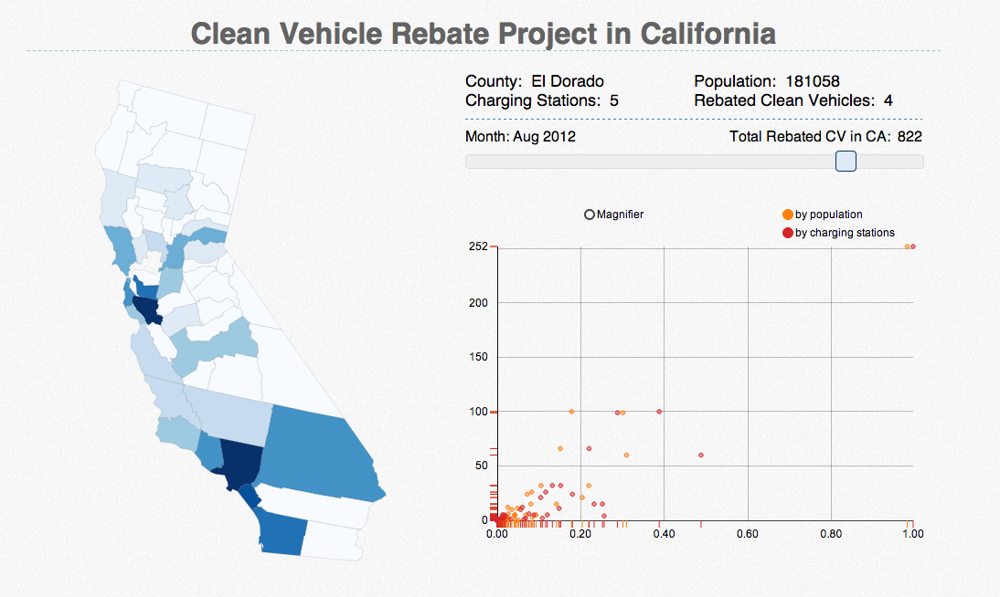
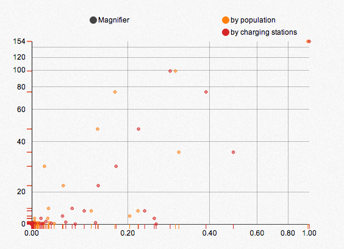
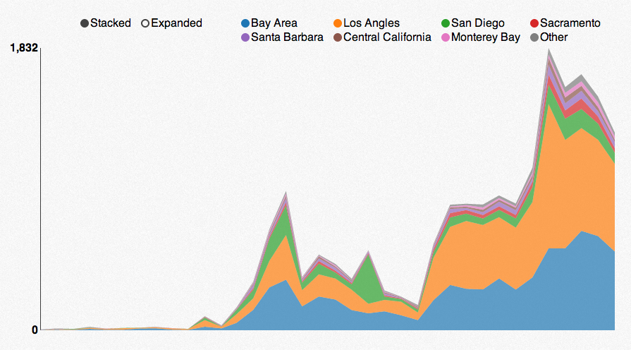
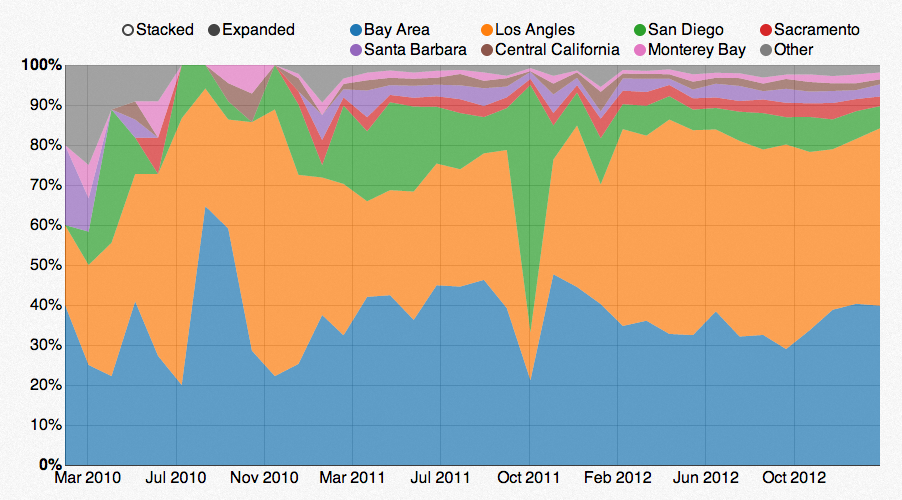

Visualizating CVRP with d3.js
=====================

Dataset
---------

[The Clean Vehicle Rebate Project (CVPR)](http://energycenter.org/clean-vehicle-rebate-project) is funded by the California Environmental Protection Agency's Air Resources Board and administered statewide by the California Center for Sustainable Energy. The project aims to promote the production and use of zero-emission vehicles, including electric, plug-in hybrid electric, and fuel cell vehicles. The CVRP database records customers’ rebate information since 2010, which is a valuable data source for clean vehicle market in California. 

My aim of visualizing the CVRP data is to find the underlying patterns in California clean vehicle market. With the introduction of the demographic data and charging station information, the data set also has the potential to reveal the correlations between clean vehicle sales and demographic condition or accessibility to charging stations. 

Design
-------
The webpage visualize data in two views: a map that combines the data with geographical information and an area chart in which users can view detailed statistics. 

The main pane that greets the users is the map view, which combines the CVRP data geographically mapped in county level. The map can be easily zoomed or panned. The fill color of each region is determined by its corresponding value. I use the blue scheme (BuGn) designed by Color Brewer 2.0 for different levels of color. Darker colors indicate the number of rebated vehicles for current month is larger for this county. When users place the cursor over a certain county in the map, the information will be updated with the county name, population, charging stations and rebated vehicles for the corresponding county.

It might be interesting for clean vehicle potential customers or analysts to see what are the major influent effects on clean vehicle sales. The scatted chart plots the relationship between the number of rebated vehicles of the county and the corresponding population and number of charging stations. When users hover on a certain point, the detailed information will be shown. The legends serve as the filter to select which category of points the users would like to show on the chart. The users can also enable the “magnifier” to zoom in some parts for details.

The slide bar is designed to allow users to browse the data in temporal dimension in month
level from Mar 2010 to Feb 2013. When the specified month changes by dragging the slide bar, the choropleth map and the scattered chart will be updated automatically. This function will visualize the data change in animation.

While the map view is useful when considered in the context of how the data might tell a geopolitical story, seeing the network in its original form is useful for many analyses. Thus, I offer a complimentary view to the map view.

The area chart view is an interactive chart adapted from the conventional area chart. The CVRP data is aggregated in area level based on the area sales and geographic closeness: Bay Area, Los Angles, San Diego, Sacramento, Santa Barbara, Central California, Monterey Bay and others. Users can filter the areas with the legend or click on the area to zoom. This view also provides the function to expand the areas to visualize the proportion of area sales.

